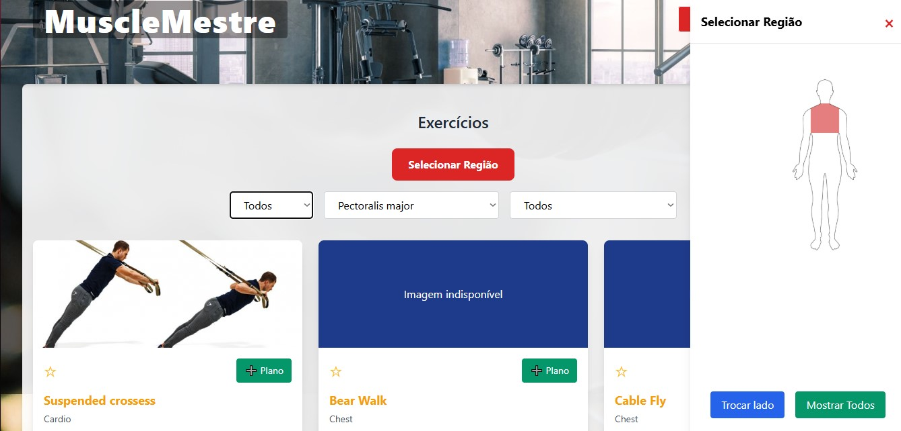

# Projeto: Consumindo uma API pública

url do site: [MuscleMestre](https://isaacsilvaink.github.io/WgerAPITesteFinal/)

### Desenvolvedores
Matheus Bevilacqua-Sistemas de informação e
Isaac Silva-Sistemas para internet

### Nosso produto

Um siste simples, onde o usuario seria capaz de acessar treinos e planos, tendo a capacidade de salvar os exercicios como favoritos, dentre outras funcionalidades.

### Desenvolvimento

O processo de desenvolvimento foi bem acidentado, falhas de conexão com a internet foram constantes. Além disso, o desconhecimento de alguma tecncnologia/ferramenta também complicou um pouco. O processo que contempla o projeto começou através das ideias, após isso, iniciciamos o desenvolvimento, utilizando as ferramentas que tinhamos disponíveis, complementando com algumas que descobrimos durante os processos.

#### Tecnologias

- HTML
- CSS
- JAVASCRIPT
- TAILWIND
- SVG

#### Ambiente de desenvolvimento

- Visual Studio Code.

#### Referências e créditos

- site sujeito programador: disponível em: https://sujeitoprogramador.com/
- Canal sujeito ptogramador: disponível em: https://www.youtube.com/@sujeitoprogramador
- Chatgpt (melhoramento e qualidade do código, além de solução de dúvidas e/ou problemas)
- Gemini(Com o propósito de melhorar a interatividade do corpo com a API e com o usuário).

---
Projeto entregue para a disciplina de [Desenvolvimento de Software para a Web](http://github.com/andreainfufsm/elc1090-2025a) em 2025a

